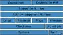

# ```netwhat```
*a 19 Coding School project*

A short introduction to networking

# Executive Summary

- LAN  : Local Area Network
- WAN  : Wide Area Network
- ISP  : Internet Service Provider
- MAC  : Media Access Control
- OUI  : Organizationally Unique Identifier
- CSMA : Carrier Sense Multiple Access
- CIDR : Classless Inter-Domain Routing
- NAT  : Network Address Translation
- DHCP : Dynamic Host Configuration Protocol
- ISN  : Initial Sequence Number
- URL  : Uniform Ressource Locator
- SMTP : Simple Mail Transfer Protocol
- IMAP : Internet Message Access Protocol
- SNMP : Simple Network Management Protocol
- ICMP : Internet Control Message Protocol
- ARP  : Address Resolution Protocol
- ACL  : Access Control List
- ACE  : Access Control Entry
- TLD  : Top Level Domain
- FQDM : Fully Qualified Domain Name

***

## [Ethernet Protocol](https://github.com/tderwedu/42cursus/blob/main/04_Netwhat/EthernetProtocol.md)
### Frames


***

## [Network Models](https://github.com/tderwedu/42cursus/blob/main/04_Netwhat/NetworkModels.md)
### OSI Layers
>**7** - Application  
>**6** - Presentation  
>**5** - Session  
>**4** - Transport  
>**3** - Network  
>**2** - Data Link  
>**1** - Physical  

### TCP/IP Layers
>**5** - Application  
>**4** - Transport  
>**3** - Network  
>**2** - Data Link  
>**1** - Physical  

***

## [IP addresses](https://github.com/tderwedu/42cursus/blob/main/04_Netwhat/IPs.md)

**IP Address = [ network ] + [ host ]**  

### Special purpose addresses
> **Network IP** : first address of a subnet (all host bits set to 0).  
> **Broadcast IP** : last address of a subnet (all host bits set to 1).  
> **The Broadcast IP** : 255.255.255.255
### IP Addresses Classes
 > | Class| Starting bits  | IP adresses Range               | CIDR |  Supports                             |
 > | :--: | :------------: | :-----------------------------: | :--: | :-----------------------------------: |
 > |   A  | 0              |  0.0.0.1    to  127.255.255.254 |  /8  | Networks: 127 - Hosts: 16 777 214     |
 > |   B  | 10             |  128.0.0.1  to  191.255.255.254 |  /16 | Networks: 16 384 - Hosts: 65 534      |
 > |   C  | 110            |  192.0.0.1  to  223.255.255.254 |  /24 | Networks: 2 097 152 - Hosts: 254      |
 > |   D  | 1110           |  224.0.0.1  to  239.255.255.254 |  /32 | Reserved for multicast                |
 > |   E  | 1111           |  240.0.0.1  to  255.255.255.254 |      | Reserved for IANA (future use or R&D) |

### Private IP addresses
 > - Class A : 10.0.0.1		to 10.255.255.254
 > - Class B : 172.16.0.1	to 172.31.255.254
 > - Class C : 192.168.1.1	to 192.168.255.254

### Subnet Stats
> **IP address** : 10.42.37.12 / 22  
> CIDR Notation : /22 -> netmask : 255.255.**252**.0  
> Magic Number : 256 - 252 = 4  
> Subnets (boundary byte 37):  
> **10.42.** [0, 4, 8, 12, 16, 20, 24, 28, 32, **36**, **40**, 44, ...]**.0**
> - **IP range** : 10.42.**36**.1 to 10.42.**39**.254
> - **Network Address** : 10.42.**36**.0
> - **Broadcast Address** : 10.42.**39**.255
> - **Number of usable IPS** : 1022 (2 ** (32 - 22) - 2)

> | CIDR % 8 | Last byte | Magic Mumber |
> | :------: | :-------: | :----------: |
> |    1     |    128    |      128     |
> |    2     |    196    |       64     |
> |    3     |    224    |       32     |
> |    4     |    240    |       16     |
> |    5     |    248    |        8     |
> |    6     |    252    |        4     |
> |    7     |    254    |        2     |

***

## [Internet Protocol](https://github.com/tderwedu/42cursus/blob/main/04_Netwhat/InternetProtocol.md)

**Packets = IP Header + Data**  
**IP Header : Source IP + Destination IP**


### TCP

**Segments = TCP Header + Data** 


- Connection Oriented  
	Build and track a connection between applications on a pair of hosts before sending data.
- Error Recovery
- Flow Control  
	The window size dynamically grows is no error is detected or dynamically shrinks in case of errors. If the  Window Size is set to 0, it pauses the sender giving the receiver time to catch up.
- Ordered Data Recovery

### UDP

**Datagram = UDP Header + Data**


- Lightweight and fast 
- Connectionless
- Supports Multicast
- No error recovery

## Data Chunks


***

# Acknowledgements
- Edith Puclla's [netwhat](https://github.com/edithturn/42-silicon-valley-netwhat)  
- Maia Chardin's [netwhat](https://github.com/Mazoise/NETWHAT_DOC/blob/master/research.md)  
- Maxime Desalle's [netwhat](https://github.com/maxdesalle/42/tree/main/netwhat)  
- Crash Course's [video](https://www.youtube.com/watch?v=guvsH5OFizE&feature=emb_title)  
- Network Direction's [videos](https://www.youtube.com/watch?v=cNwEVYkx2Kk&list=PLDQaRcbiSnqF5U8ffMgZzS7fq1rHUI3Q8)

# License
Everything in this repository is released under the [Unlicense](https://github.com/maxdesalle/42/blob/main/LICENSE).
