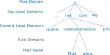

# Internet Protocol (IP)
The Internet Protocol (IP) is the principal communications protocol for transferring data across networks. IP has the task of delivering packets from the source host to the destination host solely based on the IP addresses in the packet headers. 

**Packets = IP Header + Data**  
**IP Header : Source IP + Destination IP**

Unfortunately, There no information about the application or process to give the data to. This is why IP is usually used in conjunction with UDP or TCP.

# User Datagram Protocol (UDP)

**Datagram = UDP Header + Data**

##  UDP Header

## UDP features
- Lightweight and fast 
- Connectionless
- Supports Multicast
- No error recovery

# Transmission Control Protocol (TCP)

**Segments = TCP Header + Data** 

##  TCP Header

### Port Numbers
A port is a communication endpoint. It is a 16-bit unsigned number that identifies a specific process or a type of network service. 
- Reserved Ports : 0 to 1023
- Random Ports : 1024 to 65335
### Flags
- **URG**
- **ACK** Acknowledgement
- **PSH**
- **RST** Reset
- **SYN** Synchronized
- **FIN** Finished
### Multiplexing
Multiplexing is a way for one host to have several applications accessing the network at once. They all share the same network card, the same network stack, the same IP address but they use different port numbers.
### Socket
The socket is : local IP + local Port Number + Protocol (TCP or UDP).
### 5-tuple
The 5-tuple is : local & remote IPs + local & remote Port Numbers + Protocol (TCP or UDP).
The 5-tuple is made of the remote and local socket. This is needed for web servers handling several connections at the same time.
## TCP features
- Connection Oriented  
	Build and track a connection between applications on a pair of hosts before sending data.
- Error Recovery
- Flow Control  
	The window size dynamically grows is no error is detected or dynamically shrinks in case of errors. If the  Window Size is set to 0, it pauses the sender giving the receiver time to catch up.
- Ordered Data Recovery

## TCP's Three-Way Handshake
This is the connection establishment phase. This phase initialize :
- Port Numbers
- Initial Sequence Number (ISN)
- Window Size

1. **Syn messages**  
The client sends a segment without any data but just headers :
	- **SYN** flag is turned on
	- Set the src and dst *Port Numbers*
	- The initial *Sequence Number* is chosen (random for security).
	- The *Window Size* is set.
2. **SynAck message**  
The server responds with another empty segment :
- the src and dst *Port Numbers* are switched
- The *Sequence Number* is incremented
-  **SYN** and **ACK** flags are turned on
3. **Ack message**  
The client confirm it has received the server message :
-  **ACK** flag is turned on
- The *Sequence Number* is incremented

## Closing a connection
- Graceful way  
	1. One host send a message with the flags **FIN** and **ACK** set
	2. The other device replies with 2 separate messages:
		1. An **Ack** message to confirm it has received the intention to close the connection.
		2. An **FinAck** message when the application is ready to close the connection.
	3. The first host send an **Ack** message.
- In case of error (Port Number closed, ...)
	1. One host send an **Rst** message.

## Error Recovery and Windowing

TCP and UDP can detect errors or corruption using the *checksum*. Only TCP can recover corrupted or lost data.

After the 3-Way Handshake, the *Sequence Number* represent the number of bytes sent which means the *Sequence Number* tracks the number of bytes transferred. The server must send an **Ack** message every *Window Size* incoming message (frequency of acknowledgement). If there is no error, the *Acknowledgement Number* is the next expected *Sequence Number* (Forward Acknowledgement). On the other hand, if there is an error the *Acknowledgement Number* is the *Sequence Number* corresponding to the lost data. Errors are detected by comparing the number of bytes received and the *Sequence Number*.  
If there is an error, all the segments starting the faulty one is re-transferred. One other method is the Selective Acknowledgement (SACK).

## Data Chunks

## Address Resolution Protocol (ARP)
Address Resolution Protocol (ARP) is used to match a MAC address with an IP.
1. **ARP Request**  
	The device sends a layer 2 broadcast frame to the entire LAN asking for the MAC corresponding to an IP.
2. If there is a match, the response contains the MAC and the corresponding IP. It is a unicast message to the host listed in the original request.

### ARP Cache
A table that contains all IP addresses mapped to their MAC addresses. There is a timer for each entry to limit the table size and obsolescence.
### 'RARP'
Reverse ARP. Convert MACs to IPs.
### 'GARP'
Gratuitous ARP.  
A device sends a GARP message whenever its IP changes or the device boots up. This is faster and prevent IP conflict.

## Dynamic Host Control Protocol (DHCP)
Dynamic Host Configuration Protocol (DHCP) is a network management protocol used to automate IP configuration of devices on the network. This includes IP address, subnet mask, default gateway, and DNS information. It employs a connectionless services model like UDP.

Whenever a device connects to the network :  
1. **Discover**  
	The device broadcast a special DHCP discover message which contains its MAC address.
2. **Offer**  
	The DHCP server looks for an available IP in the addresses pool and reserves it. The available IP is sent through an offer message.
3. **Request**  
	If the client receives more than one offer, he selects one IP and formally ask for permission to use it by broadcasting a DCHP request message.
4. **Acknowledgement**  
	The server sends a DHCP acknowledgement.
### Static Allocation
The DHCP is configured to gives a specific IP to a client (MAC address).
### DHCP Relay
Routers may act as a DHCP relay. When a request is catched up by the router, the router forward the request to the DHCP server.

## Domain Name System
Convert Domain Name to IP addresses.

> *www.networkdirection.net*  
> Fully Qualified Domain Name (FQDM)):
> 1. Top level Domain : net
> 2. Second Level Domain : networkdirection
> 3. Host Name : www

DNS servers contain one or more database called zones. The zones represent domains such as "networkdirection.net".  
Each zone contains piece of information called records. They are different types of records the most common being the host record.  
The forward Lookup zone contains the name to IP mapping of all the hosts within the domain. If a DNS server has a zone for a particular domain name, then this server is authoritative for that domain. This means that the DNS server is a legitimate source of information for that domain.  
When a DNS server is non-authoritative for a domain it may ask another DNS for help.

### Recursive Query
When a DNS server is non-authoritative and ask a query to an external DNS and forward the response.
### Root In or Iterative Query
They are 13 IP addresses for special DNS server around the world which are called *Root Servers*. They are authoritative for root namespace. They know how to find DNS servers for each Top-Level Domains (TLD).
So, when our DNS server does not know the domain, it can an Iterative Query.
- Asking a Root Server for the IP for the proper Top Level DNS authoritative server,
- Asking the TLD DNS server for the IP of the Second Level DNS server,
- ...

## Access Control List (ACL)
An Access Control List (ACL) is list or rules. Each rule is Access Control Entry (ACE) and is used to permit or deny traffic. The list is evaluated from top to bottom. Each rule contains information such as src/dst IP address, src/dst port numbers, protocol used, ...
If the incoming traffic does not match any rule, there is an invisible rule at the end of the list called *the implicit deny* ('deny any any').

ACLs can use wildcards which are bits mask. The part that needs to match is made up of zeros and the free part is made of ones! There is also no restriction on the wildcard values like subnet masks.

## Loopback Interface

The Internet Protocol (IP) specifies a loopback network with the (IPv4) address 127.0.0.0/8. Any traffic that a computer program sends on the loopback network is addressed to the same computer. The most used IP address on the loopback network is `127.0.0.1` for IPv4 and `::1` for IPv6. The standard domain name for the address is `*localhost*`.

The loopback interface is used to identify the device or determine if the device is online. Any interface address can be used but interfaces might be removed, or some addresses may change. The loopback address on the other hand never changes.

Benefits of Loopback Interface :
- As the loopback address never changes, it is the best way to identify a device in the network.
- The loopback interface is always up, and it is reachable if the route to that IP address is available in the IP routing table. Hence you can use the loopback interface for diagnostics and troubleshooting purposes.
- Some protocols need a loopback address to function correctly.

# Routing

### Circuit switching 
Switching whole circuits to route traffic to the correct destination. This is inflexible and expensive due to the unused capacity. This is still used by banks, military, ... (security purpose ? ...)
### Message Switching 
Data hop from one Network Router to another getting closer and closer to the destination. This solution allows using different routes and is therefore fault tolerant.

 - Hop Count : Number of hops a message takes along a route. This helps detect error when the hop count gets too high.
 - Hop Limit : Maximum number of hops has message can takes.

 **Big files can clog up the network because the whole data must be transmitted from one router to the next before continuing its way.**
 
 ## Packets
Chop up big transmission into many small pieces called packets.

## Packet Switching
Chopping up data into small packets and passing these along flexible routes with spare capacity.

Pros
- Efficient
- Fault Tolerant
- Decentralized

Cons
- Packets can arrives at their destination out of order.

# The Internet [quite dull ...]
LAN -> WAN -> wider WAN -> Wider and Wider WAN -> Widest Wan -> WAN -> LAN
Router run by an Internet Service Provider (ISP).

# The world Wide Web

The web is made of pages. A page is a document containing contents which can include links to other pages (Hyperlinks). The hyperlinks form a huge web of interconnected information.

## Uniform Resource Locator (URL)

Each hypertext page has a unique address called URL (Uniform Resource Locator).

## HyperText Transport Protocol (HTTP)

HyperText Transport Protocol is protocol used to carry a web page from a web server. Web page Hypertext are stored as plain text encoded in ASCII or UTF-16.

- Status Code : prefix any hypertext
	- 200 : everything ok
	- 4xx : client errors
- Web browser : Requests and renders web pages.

## HyperText Markup Language (HTML)
Allows  to mark up a text file with hypertext element.  
- HTML tags : **<#>...<\\#>**

What is ping:

Ping is a computer network administration software utility used to test the reachability of a host on an Internet Protocol (IP) network.
Ping operates by sending Internet Control Message Protocol (ICMP - Layer 3) echo request packets to the target host and waiting for an ICMP echo reply.
