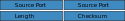

# ```netwhat```
*a 19 Coding School project*

A short introduction to networking

# Executive Summary

- LAN  : Local Area Network
- WAN  : Wide Area Network
- ISP  : Internet Service Provider
- MAC  : Media Access Control
- OUI  : Organizationally Unique Identifier
- CSMA : Carrier Sense Multiple Access
- CIDR : Classless Inter-Domain Routing
- NAT  : Network Address Translation
- DHCP : Dynamic Host Control Protocol
- ISN  : Initial Sequence Number
- URL  : Uniform Ressource Locator
- SMTP : Simple Mail Transfer Protocol
- IMAP : Internet Message Access Protocol
- SNMP : Simple Network Management Protocol
- ICMP : Internet Control Message Protocol
- ARP  : Address Resolution Protocol
- ACL  : Access Control List
- ACE  : Access Control Entry
- TLD  : Top Level Domain
- FQDM : Fully Qualified Domain Name

## [Ethernet Protocol](https://github.com/tderwedu/42cursus/blob/main/04_netwhat/EthernetProtocol.md)
### Frames

## [Network Models](https://github.com/tderwedu/42cursus/blob/main/04_netwhat/NetworkModels.md)
### OSI Layers
>**7** - Application  
>**6** - Presentation  
>**5** - Session  
>**4** - Transport  
>**3** - Network  
>**2** - Data Link  
>**1** - Physical  

### TCP/IP Layers
>**5** - Application  
>**4** - Transport  
>**3** - Network  
>**2** - Data Link  
>**1** - Physical  

## [IP addresses](https://github.com/tderwedu/42cursus/blob/main/04_netwhat/IPs.md)

**IP Address = [ network ] + [ host ]**  

### Special purpose addresses
> Network IP : first address of a subnet (all host bits set to 0).  
> Broadcast IP : last address of a subnet (all host bits set to 1).  
> The Broadcast IP : 255.255.255.255
### IP Addresses Classes
 > | Class| Starting bits  | IP adresses Range               | CIDR |  Supports                             |
 > | :--: | :------------: | :-----------------------------: | :--: | :-----------------------------------: |
 > |   A  | 0              |  0.0.0.1    to  127.255.255.254 |  /8  | Networks: 127 - Hosts: 16 777 214     |
 > |   B  | 10             |  128.0.0.1  to  191.255.255.254 |  /16 | Networks: 16 384 - Hosts: 65 534      |
 > |   C  | 110            |  192.0.0.1  to  223.255.255.254 |  /24 | Networks: 2 097 152 - Hosts: 254      |
 > |   D  | 1110           |  224.0.0.1  to  239.255.255.254 |      | Reserved for multicast                |
 > |   E  | 1111           |  240.0.0.1  to  255.255.255.254 |      | Reserved for IANA (future use or R&D) |

### Private IP addresses
 > - Class A : 10.0.0.1		to 10.255.255.254
 > - Class B : 172.16.0.1	to 172.31.255.254
 > - Class C : 192.168.1.1	to 192.168.255.254

### Subnet Stats
> **IP address** : 10.42.37.12 / 22  
> CIDR Notation : /22 -> netmask : 255.255.**252**.0  
> Magic Number : 256 - 252 = 4  
> Subnets (boundary byte 37):  
> **10.42.** [0, 4, 8, 12, 16, 20, 24, 28, 32, **36**, **40**, 44, ...]**.0**
> - **IP range** : 10.42.**36**.1 to 10.42.**39**.254
> - **Network Address** : 10.42.**36**.0
> - **Broadcast Address** : 10.42.**39**.255
> - **Number of usable IPS** : 1022 (2 ** (32 - 22) - 2)

> | CIDR % 8 | Last byte | Magic Mumber |
> | :------: | :-------: | :----------: |
> |    1     |    128    |      128     |
> |    2     |    196    |       64     |
> |    3     |    224    |       32     |
> |    4     |    240    |       16     |
> |    5     |    248    |        8     |
> |    6     |    252    |        4     |
> |    7     |    254    |        2     |

## [Internet Protocol](https://github.com/tderwedu/42cursus/blob/main/04_netwhat/InternetProtocol.md)

**Packets = IP Header + Data**  
**IP Header : Source IP + Destination IP**


### TCP

**Segments = TCP Header + Data** 


- Connection Oriented  
	Build and track a connection between applications on a pair of hosts before sending data.
- Error Recovery
- Flow Control  
	The window size dynamically grows is no error or dynamically shrinks in case of errors. If the  Window Size is set to 0 it pause the sender giving the receiver time to catch up.
- Ordered Data Recovery

### TCP

**Datagram = UDP Header + Data**


- Lightweight and fast 
- Connectionless
- Supports Multicast
- No error recovery

## Data Chunks


# Acknowledgements
- Edith Puclla's [netwhat](https://github.com/edithturn/42-silicon-valley-netwhat)  
- Maia Chardin's [netwhat](https://github.com/Mazoise/NETWHAT_DOC/blob/master/research.md)  
- Maxime Desalle's [netwhat](https://github.com/maxdesalle/42/tree/main/netwhat)  
- Crash Course's [video](https://www.youtube.com/watch?v=guvsH5OFizE&feature=emb_title)  
- Network Direction's [videos](https://www.youtube.com/watch?v=cNwEVYkx2Kk&list=PLDQaRcbiSnqF5U8ffMgZzS7fq1rHUI3Q8)

# License
Everything in this repository is released under the [Unlicense](https://github.com/maxdesalle/42/blob/main/LICENSE).
