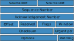

W.I.P. needs to concatenate several sources AND reorganise/rewrite !!

**Executive Summary (W.I.P.)**

- LAN  : Local Area Network
- WAN  : Wide Area Network
- MAC  : Media Access Control
- CSMA : Carrier Sense Multiple Access
- ISP  : Internet Service Provider
- CIDR : Classless Inter-Domain Routing
- NAT  : Network Address Translation
- DHCP : Dynamic Host 
- dst  : destination
- src  : source
- ISN  : Initial Sequence Number

# Ethernet

All computer are connected to a single common ethernet cable (BUS-like). Transmitted data is accessible to every computer plugged to the network. Each computer has a unique M.A.C. (Media Access Control) address. Data is only processed when the MAC address correspond to the computer's one.

## Carrier Sense Multiple Access (CSMA)
Carrier Sense Multiple Access (CSMA) is a Media Access Control protocol in which a device verifies the absence of other traffic before transmitting on a shared transmission medium.

- Bandwidth : rate at which a carrier can transmit data
- Collision : two or more devices write simultanously data
- Collision Domain : list of devices sharing the same ethernet cable

To avoid collision
1. When devices while transmitting data detect a collision, they wait for brief period before attempting to re-transmit. The waiting time has a random random component.
2. Exponential Backoff : When multiple collisions happen in a row, the waiting time increases exponentially.
3. Using a switch or Bridge to break the LAN into smaller sub-domains.

# Routing
## Circuit switching 
Switching whole circuits to route traffic to the correct destination. This is inflexible and expensive due to the unused capacity. This is still used by banks, military, ... (security purpose ? ...)
## Message Switching 
Data hop from one Network Router to another getting closer and closer to the destination. This solution allows using different routes and is therefore fault tolerant.

 - Hop Count : Number of hops a message takes along a route. This helps detect error when the hop count gets to high.
 - Hop Limit : Maximum number of hops has message can takes.

 **Big files can clog up the network because the whole data has to be transmitted from one router to the next before continuing ont its way.**
 
 ## Packets
Chop up big transmission into many small pieces called packets.

# IP adresses

IP addresses consist of two groups of bits in the address: the most significant bits are the network prefix, which identifies a whole network or subnet, and the least significant set forms the host identifier, which specifies a particular interface of a host on that network.

IP addresses have two functions
- network identification
- host identification

**IP Addres = [ network ] + [ host ]**

> Special purpose addresses :  
> Network IP : first address of a subnet (all host bits set to 0).  
> Broadcast IP : last address of a subnet (all host bits set to 1).  
> The Broacast IP : 255.255.255.255

This last IP is used when a device is starting up and has not IP address nor information about the local subnet. This IP allow to send traffic everywhere.

### Assiging Addresses
1. Static addresses (routers and some server)
2. Dynamic addresses with a Dynamic Host Configuration Protocol (DHCP).  
3. Automatic Private Ip addressing (unsusual).

## Evolutions

1. One byte for the network and 3 bytes for the host.
2. IP addresses classes
3. Classless IP addresses and subnets

## IP addresses classes

1. The class is identified by looking at the first few bits.
2. Knowing the class, we can separate the part for the network from the part for the host.

 > | Class| Starting bits  | IP adresses Range               | CIDR |  Supports                             |
 > | ---- | -------------- | ------------------------------- | -----| --------------------------------------|
 > |   A  | 0              |  0.0.0.1    to  127.255.255.254 |  /8  | Networks: 127 - Hosts: 16 777 214     |
 > |   B  | 10             |  128.0.0.1  to  191.255.255.254 |  /16 | Networks: 16 384 - Hosts: 65 534      |
 > |   C  | 110            |  192.0.0.1  to  223.255.255.254 |  /24 | Networks: 2 097 152 - Hosts: 254      |
 > |   D  | 1110           |  224.0.0.1  to  239.255.255.254 |      | Reserved for multicast                |
 > |   E  | 1111           |  240.0.0.1  to  255.255.255.254 |      | Reserved for IANA (future use or R&D) |
  
- Unicast traffic : send traffic to only one device.
- Multicast traffic : send traffic to multiple devices
- Broadcast traffic : send traffic to every devices

The advantage of this system is that the network prefix could be determined for any IP address without any further information. The disadvantage is because only three sizes are available, networks were usually too big or too small for most organizations to use.

### Multicast Traffic
Streaming servers send traffic to a multicast IP and other hosts looks for traffic send to that IP. Routers forward multicast traffic.

### Internet Assigned Numbers Authority (IANA)
1. The Internet Assigned Numbers Authority assign IP addresses to Regional Internet Registries (RIRs).
2. RIRs assign space to Internet Service Proveiders (ISPs) and large customers.
3. ISPs gives IPs to their customers.

## Classless Networks and Subnets

Classless Inter-Domain Routing (CIDR) has been developped to replace the previous classful network addressing architecture on the Internet to help slow the rapid exhaustion of IPv4 addresses. CIDR is based on Variable-Length Subnet Masking (VLSM). The VSLM is used to distinguish the network's IP from the host interface. CIDR also introduced the so-called CIDR notation ("/x").

CIDR allows subnetting which is breaking a large network into smaller ones.

### Variable-Lenght Subnet Masking
A subnet mask or netmask is a bitmask that encodes the prefix length associated with an IPv4 address. The prefix bits are always contiguous (a series of ones followed by a series of zeros until the end).

> **IP address** : 10.42.37.12 / 22  
> CIDR Notation : /22 -> netmask : 255.255.**252**.0  
> Magic Number : 256 - 252 = 4  
> Subnets (boundary byte 37):  
> **10.42.** [0, 4, 8, 12, 16, 20, 24, 28, 32, **36**, **40**, 44, ...]**.0**
> - **IP range** : 10.42.**36**.1 to 10.42.**39**.254
> - **Network Address** : 10.42.**36**.0
> - **Broadcast Address** : 10.42.**39**.255
> - **Number of usable IPS** : 1022 (2 ** (32 - 22) - 2)

## Default Gateway

The default gateway is the local router Ip address. This is also kmown as the Gateway of Last Resort as this is the last host to which data is sent. To avoid broadcast loop between routers, routers never forward broadcast messages.

## Private Addresses (RFC 1918)
This are IP addresses for private use. We can use these IPs in any way we want within a **local** network. They are therefore not allowed int the Internet.

 > Ranges for private IP addresses :
 > - Class A : 10.0.0.1		to 10.255.255.254
 > - Class B : 172.16.0.1	to 172.31.255.254
 > - Class C : 192.168.1.1	to 192.168.255.254

# Open System Interconnection Model (OSI Model)

Developped by the ISO (International Organization for Standardization). Unlike the TCP/IP model the OSI model has never really been implemented. It is mostly used as a reference model for educational purposes. It is a conceptual framework for compartilizing the different network processes.

>**7** - Application  
>**6** - Presentation  
>**5** - Session  
>**4** - Transport  
>**3** - Network  
>**2** - Data Link  
>**1** - Physical  

### **Application**
FTP, web browsing, email, network management session (like ssh), ...
### **Presentation**
Data formating (data formats) and conversion (encryption, compression).
### **Session**
Application processes, reauest to remote services (Session Control Services - SCP)
### **Transport**
Responsible for data transport between two endpoints. Breaks data into segments (TCP) or datagram (UDP). Each flow of data has two port numbers. One is associated to the source and one the the destination.  
TCP, UDP, ...  
Port number *80* for web server, ...
### **Network**
Network (IP) addresses and routing. After adding the IP addresses the pieces of data are called data segments.
### **Data Link**
Getting data between two devices which are not necessarily the two endpoints. Creates a logical link between devices which are not directly connected.  
Ethernet.
### **Physical**
Encodes data into physical signals.

# TCP/IP

> *Original*  
>**4** - Application  
>**3** - Transport  
>**2** - Internet  
>**1** - Link  

> *Current*  
>**5** - Application  
>**4** - Transport  
>**3** - Network  
>**2** - Data Link  
>**1** - Physical  

TCP/IP allows using existing protocols like Ethernet if they already exist.

*Data Transfer Layers - [1-3]*  
*Application and Processes Layers - [4-5]*
- FTP : file transfer
- HTTP : web browsing
- SMTP/IMAP : email
- ...  
These applicaitons create processes which listen on a particular port number. The processes are either UDP or TCP.

### **Application**
This layer  describes how applicaitons use the network.
### **Transport**
TCP or UDP creates and maintains conversations between application processes on different hosts. They use port numbers to track sessions.
### **Network**
Converts data segment or datagram into packets by adding a header with the source and destination IPs.
### **Data Link**
Responsible of delivering traffic on a single network segment, LAN or subnet.  
If Ethernet protocol is used:  
1. If the 2 hosts are in the same subnet then delivery is achieved using M.A.C. addresses.
2. If the 2 hosts are in different subnets routers are needed and the destination (dst) M.A.C. is the router. The router looks at the dst IP and set the M.A.C. addresse accordingly. The source (src) M.A.C. addresse becomes the one of the router.
### **Physical**
Encodes data into physical signals.

# Transmission Control Protocol (TCP)

### Port Numbers
- Reserved Ports : 0 to 1023
- Random Ports : 1024 to 65335
### Flags
- **URG**
- **ACK** Acknowledgement
- **PSH**
- **RST** Reset
- **SYN** Synchronised
- **FIN** Finished
### Multiplexing
Multiplexing is a way for one host to have several applications accessing the network at once. They all share the same network card, the same network stack, the same IP address but they use different port numbers.
### Socket
The socket is : local IP + local Port Number + Protocol (TCP or UDP).
### 5-tuple
The 5-tuple is : local & remote IPs + local & remote Port Numbers + Protocol (TCP or UDP).
The 5-tuple is made of the remote and local socket. This is needed for web servers handling several connections at the same time.
### TCP features
- Connection Oriented  
	Build and track a connection between applications on a pair of hosts before sending data.
- Error Recovery
- Flow Control
	The window size dynamically grows is no error or dynamically shrinks in case of errors. If the  Window Size is set to 0 it pause the sender giving the receiver time to catch up.
- Ordered Data Recovery
- Allows Additional Features

## TCP's Three-Way Handshake
This is the connection establishment phase. This phase initialise :
- Port Numbers
- Initial Sequence Number (ISN)
- Window Size

1. **Syn messages**  
The client send a segment without any data but just headers :
	- **SYN** flag is turned on
	- Set the src and dst *Port Numbers*
	- The initial *Sequence Number* is chosen (random for security).
	- The *Window Size* is set.
2. **SynAck message**  
The server respond with another empty segment :
- the src and dst *Port Numbers* are switched
- The *Sequence Number* is incremented
-  **SYN** and **ACK** flags are turned on
3. **Ack message**  
The client confirm it has received the server message :
-  **ACK** flag is turned on
- The *Sequence Number* is incremented

## Closing a connection
- Graceful way  
	1. One host send a message with the flags **FIN** and **ACK** set
	2. The other device replies with 2 separate messages:
		1. An **Ack** message to confirm it has received the intention to close the connection.
		2. An **FinAck** message when the application is ready to close the connection.
	3. The first host send an **Ack** message.
- In case of error (Port Number closed, ...)
	1. One host send an **Rst** message.

## Error Recovery and Windowing
TCP and UDP can dectect errors or corruption using the *checksum*. Only TCP can recover corrupted or lost data.

After the 3-Way Handshake, the *Sequence Number* represent the number of byte sent which means the *Sequence Number* tracks the number of bytes transfered. The server has to send an **Ack** message every *Window Size* incomming message (frequency of acknowledgement). If there is no error, the *Acknowlegement Number* is the next expected *Sequence Number* (Forward Acknowledgement). On the other hand, if there is an error the *Acknowlegement Number* is the *Sequence Number* corresponding to the lost data. Errors are detected by comparing the number of bytes actually received and the *Sequence Number*.  
If there is an error, all the segments starting the faulty one are re-transfered. One other method is the Selective Acknowledgement (SACK).

# User Datagram Protocol (UDP)

### UDP features
- Lightweight and fast 
- Connectionless
- No error recovery

# Internet Protocol (IP)
 - IP address : every device connected to the network gets an IP address.

## Packet Switching
Chooping up data into small packets and passing these along flexible routes with spare capacity.

Pros
- Efficient
- Fault Tolerant
- Decentralized

Cons
- Packets can arrives at their destination out of order.

## The Internet [quite dull ...]
LAN -> WAN -> wider WAN -> Wider and Wider WAN -> Widest Wan -> WAN -> LAN
Router runned by an Internet Service Provider (ISP).

## Internet Protocol (IP) [again ...]

**Packets = IP Header + Data**

IP Header:
- src Ip
- dst IP

Cons
- No information about the application to give the data to.

# User Datagram Protocol (UDP)

**Packets = IP Header + Data**  
**Packets = IP Header + UDP Header + Data**

UDP Header
- Port Number : each program having access to the internet has an unique port granted by the OS
- Cheksum : used to verify the integrity of the data. = sum of bytes (16 bits number)

Pros
- Really simple and fast

Cons
- No information to know if sent packets are getting through.
- No error recovery system

# Transmission Control Protocol (TCP)

**Packets = IP Header + Data**  
**Packets = IP Header + TCP Header + Data**

TCP Header
- Port Number
- Cheksum
- Sequence Number
- Congestion Control

Pros
- Robust

Cons
- Increase delays
- Increase usage of the internet

## Domain Name System
Convert Domain Name  to IP addresses.
1. Top level Domains (com, be, net, ...)
2. Second Level Domains (google.com, youtube.com)
3. Sub-domains of Parrent (images.google.com)

# The world Wide Web

The web is made of pages. A page is a document containing contents which can include links to other pages (Hyperlinks). The hyperlinks form a huge web of interconnected information.

## Uniform Ressource Locator (URL)

Each hypertext page has a uniaue address called URL (Uniform Ressource Locator).

## HyperText Transport Protocol (HTTP)

HyperText Transport Protocol is protocol used to carry a web page from a web server. Web page Hypertext are stored as plain text encoded in ASCII or UTF-16.

- Status Code : prefix anny hypertext
	- 200 : everything ok
	- 4xx : client errors
- Web browser : Requests and renders web pages.

## HyperText Markup Language (HTML)
Allows  to mark up a text file with hypertext element.  
- HTML tags : **<#>...<\\#>**
