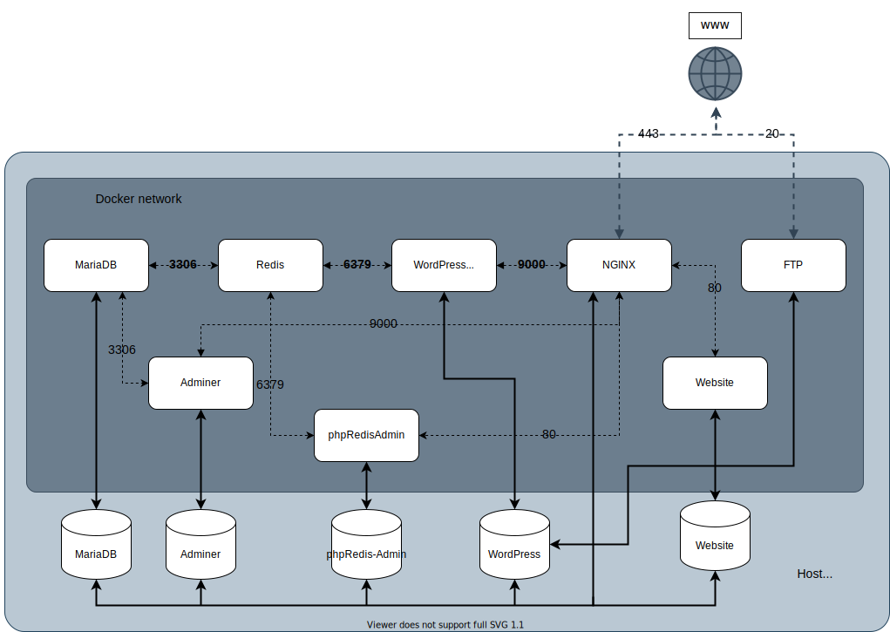

# ```Inception```
*a 19 Coding School project*

This project aims to broaden our knowledge of system administration and networking. A complete infrastructure has to be set up using multiple docker containers working together.



## Acknowledgements

- Justin Ellingwood's article [Understanding and implementing fastcgi](https://www.digitalocean.com/community/tutorials/understanding-and-implementing-fastcgi-proxying-in-nginx)
- Vsupalov's article [Docker ARG, ENV and .env - a Complete Guide](https://vsupalov.com/docker-arg-env-variable-guide/)
-  Melissa Anderson and Kathleen Juell's article [How To Set Up vsftpd](https://www.digitalocean.com/community/tutorials/how-to-set-up-vsftpd-for-a-user-s-directory-on-debian-10)
- Aaron Kili's article [How to Secure a FTP Server](https://www.tecmint.com/secure-vsftpd-using-ssl-tls-on-centos/)
- Openclassroom's [Gestion des utilisateurs](https://openclassrooms.com/fr/courses/1959476-administrez-vos-bases-de-donnees-avec-mysql/1975880-gestion-des-utilisateurs)
- Dave Raggett's article [Getting started with HTML](https://www.w3.org/MarkUp/Guide/)
-  Scott Miller's tutorial [How To Configure Redis](https://www.digitalocean.com/community/tutorials/how-to-configure-redis-caching-to-speed-up-wordpress-on-ubuntu-14-04)
- Joel Hans's article [Redis Cache For Speeding Up Your WordPress Website](https://blog.ssdnodes.com/blog/redis-cache-wordpress/)


## License

Everything in this repository is released under the [Unlicense](https://github.com/tderwedu/42cursus/blob/main/LICENSE).

