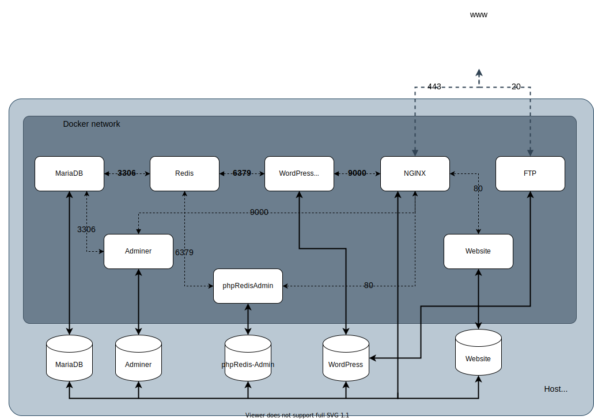

# ```Inception```
*a 19 Coding School project*

This project aims to broaden our knowledge of system administration and networking. A complete infrastructure has to be set up using multiple docker containers working together.



## Acknowledgements

- Justin Ellingwood's article [Understanding and implementing fastcgi](https://www.digitalocean.com/community/tutorials/understanding-and-implementing-fastcgi-proxying-in-nginx)

## License

Everything in this repository is released under the [Unlicense](https://github.com/tderwedu/42cursus/blob/main/LICENSE).

