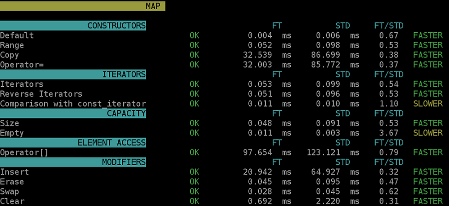

[# ```ft_containers```
*a 19 Coding School project*

Re-implementation of some containers present in C++
- `vector`
- `map`
- `stack`  
and the following functionnalities
- `iterators_traits`
- `reverse_iterator`
- `enable_if`
- `is_integral`
- `equal/lexicographical compare`
- `std::pair`
- `std::make_pair`

# Testing



This project can be tested by performing a `make` command at the root of the repository.
This command will generate 3 binaries and run them:
 - `ft` : to run the tests using this project containers.
 - `std` : to run the tests using the stl/std containers
 - `compare_time` : can be used to compare timings
```shell
./compare_time "ft.res" "std.res"
```
with `"ft.res"` and `"std.res"` the output from the `ft` and the `std` binaries
```shell
./ft "ft.res"
./std "std.res"
```

## Acknowledgements

- StavkOverflow's F.A.Q. [What are the basic rules and idioms for operator overloading?](https://stackoverflow.com/questions/4421706/what-are-the-basic-rules-and-idioms-for-operator-overloading/4421729)
- h-deb's article [Comprendre enable_if](https://h-deb.clg.qc.ca/Sujets/TrucsScouts/Comprendre_enable_if.html)
- StavkOverflow's question [How to use SFINAE to restrict overload to input iterators](https://stackoverflow.com/questions/25668966/how-to-use-sfinae-to-restrict-overload-to-input-iterators)
- StavkOverflow's question [Priorities of constructors c++](https://stackoverflow.com/questions/16967797/priorities-of-constructors-c)
- Vanand Gasparyan's article [What is an Allocator?](https://medium.com/@vgasparyan1995/what-is-an-allocator-c8df15a93ed)
- Brilliant's wiki [Red-Black Tree](https://brilliant.org/wiki/red-black-tree/)
- Cay Horstmann's article [Easy Red-Black Trees](https://horstmann.com/unblog/2011-05-12/blog.html)
- Matt Might's article [The missing method: Deleting ...](https://matt.might.net/articles/red-black-delete/)

## License

Everything in this repository is released under the [Unlicense](https://github.com/tderwedu/42cursus/blob/main/LICENSE).
